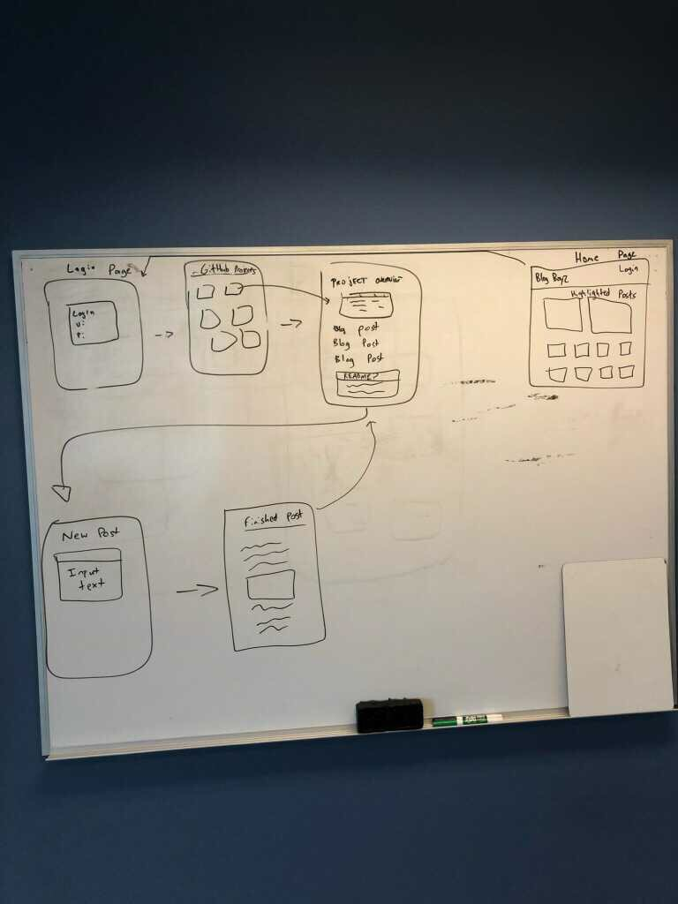

# GitHug

#### By **Ian Cook Westgate**, **Dino Nguyen**, **Jack Collins**, **Matt Groberg**

## Description

Have you ever complained about the inability of Medium, Blogger, and Wordpress to reference your GitHub account? Have you ever wanted to blog about the projects you create on GitHub to an audience of enthusiastic fellow programmers? GitHug is the site for you: a blogging hub where you can get recognition and support for your GitHub labors as you work on every new project, all with easy reference to every bit of data you need from your GitHub account.

## Wireframing

## Features

* User can login to the GitHug database and incorporate their repo info by logging into Github.
* Full blogging functionality through the TinyMCE text editor.
* All created posts can be assigned to the GitHub repo of the user's choice. These posts are then readable by anyone looking at the chosen repo on GitHug.

## Setup

* Install Node.js.
* Clone the repo: https://github.com/jackpaulcollins/angular-team-project.git.
* Navigate to the folder in the terminal by typing in: "cd angular-team-project".
* `npm install` to install dependencies.
* Create and/or use an account with https://firebase.google.com/.
* Click the "GO TO CONSOLE" link in the top right of the screen.
* On the next page, click "Add project" below the + sign. Create a project with a name of your choice.
* When you get to the main page for this new project, click the "</>" icon near the center left of the screen.
* In the pop-up, note the part of the file that looks like this:
  'apiKey: "abcdefghijklmnopqrstuvwxyz12345",'
* Create an "api-keys.ts" file in the "app" folder of this project. Copy paste the info above into this new file. Take the API key that you created and put it in the "apiKey" section.
  export const masterFirebaseConfig = {
    apiKey: _"Put your apiKey here!"_,
    authDomain: "github-api-e0774.firebaseapp.com",
    databaseURL: "https://github-api-e0774.firebaseio.com",
    projectId: "github-api-e0774",
    storageBucket: "github-api-e0774.appspot.com",
    messagingSenderId: "486286274954"
  };
* Back in your terminal, run `ng serve --open` for a dev server. This will open a window in your web browser with which to view the project. The app will automatically reload if you change any of the source files.

## Planned Features

*
*
*

## Technologies Used

* HTML
* CSS
* JavaScript
* Node.js
* Babel
* Webpack
* Firebase
* Angular CLI version 1.6.5
* API
  * GitHub
  * TinyMCE

## Known Bugs

*
*
*

## License

This software is licensed under the MIT license.

Copyright (c) 2019 **Jack Collins**, **Ian Cook Westgate**, **Matt Groberg**, **Dino Nguyen**
